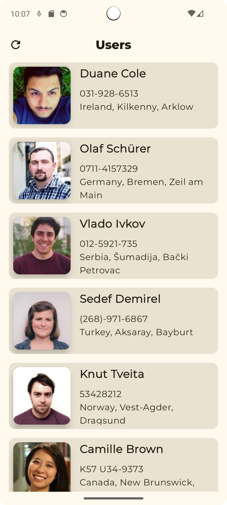
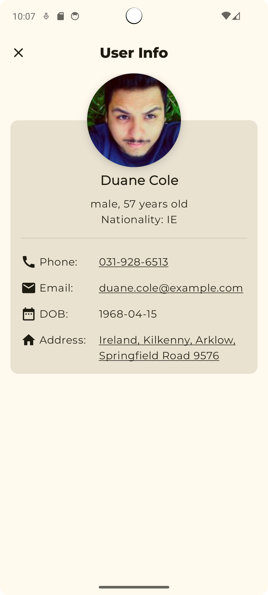

# Random User

**Random User** — Android-приложение, которое отображает список случайных пользователей, полученных с сервиса [randomuser.me](https://randomuser.me). Проект реализован в рамках тестового задания для поступления на курс **ШИФТ от ЦФТ**.

## 🛠️ Технологии

- Язык: **Kotlin**
- Архитектура: **MVVM**
- UI: **Jetpack Compose**
- Сетевые запросы: **Retrofit**
- Асинхронность: **Coroutines**, **Flow**
- Работа с JSON: **kotlinx.serialization**
- Кэширование данных: **Room**
- Загрузка изображений: **Coil**

## ⚙️ Возможности

- 📄 Вывод списка пользователей с краткой информацией: ФИО, фотография, адрес и номер телефона.
- 🔍 Переход к подробной информации о пользователе по клику на элемент списка.
- ♻️ Сохранение данных при перезапуске приложения (кэширование через Room).
- 📲 Интерактивность:
  - Нажатие на email открывает почтовое приложение.
  - Нажатие на номер телефона — звонилку.
  - Адрес и координаты — открытие карт.
- 🔄 Обновление списка пользователей вручную.
- ⚠️ Уведомления об ошибках загрузки и работы с данными.

## 📸 Скриншоты

| Список пользователей | Детали пользователя |
|----------------------|---------------------|
|  |  |

## 📍 Назначение

Тестовое задание для отбора на курс **ШИФТ от ЦФТ**.

---

